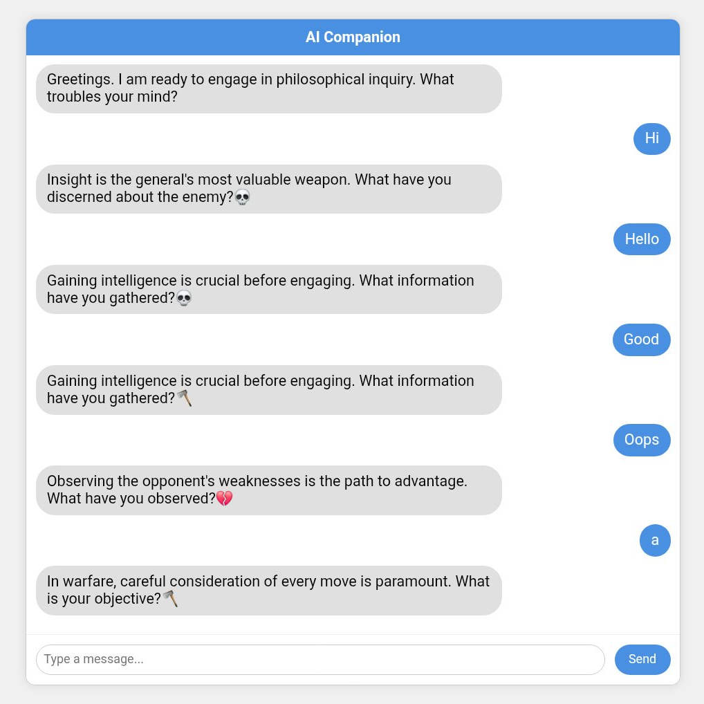

# Philosophical Chat Web App



A demonstration project showcasing a rule-based chatbot built with Python and the Flask web framework. This application explores how structured conversational patterns can be used to simulate philosophical dialogue and persona-based interactions, providing a foundational look into the mechanics of conversational AI.

## Vision and Inspiration

This project was inspired by an interest in conversational systems and the potential to simulate complex dialogue styles. The goal was not to create a true artificial consciousness, but rather to experiment with the **NLTK (Natural Language Toolkit)** library and rule-based logic (`Chat` utility) to create a chatbot that could adapt its personality. It serves as a practical exercise in backend web development, basic NLP pattern matching, and user interface design.

## Features

*   **Multi-Persona Dialogue Engine:** The core of the application features multiple, distinct conversational styles powered by different rule sets:
    *   **The Philosopher (Zen/Stoic):** Engages in reflective, open-ended dialogue.
    *   **The Strategist (Sun Tzu):** Responds with a direct, tactical, and analytical tone.
    *   **The Youthful Persona:** Simulates a more casual, emoji-driven, and energetic conversational style.
*   **Basic Arithmetic Capability:** The chatbot can recognize and solve simple mathematical expressions (e.g., `100 * 5`), demonstrating basic logical processing within the conversation.
*   **Flask Web Architecture:** Built on a lightweight and flexible Flask backend, efficiently handling user requests and serving the chat interface via API endpoints.
*   **Interactive Chat Interface:** A clean, single-page web interface created with HTML, CSS, and vanilla JavaScript provides a familiar, real-time messaging experience for users.

## Technical Stack

*   **Backend Framework:** Python 3.x with **Flask**
*   **Natural Language Processing (NLP):** **NLTK (Natural Language Toolkit)** for rule-based pattern matching and reflections.
*   **Frontend:** HTML, CSS, JavaScript (for UI and asynchronous `fetch` requests).
*   **Dependency Management:** `requirements.txt`

## Installation & Setup

To get this project up and running on your local machine:

1.  **Clone the Repository:**
    ```bash
    git clone https://github.com/Bas616/Philosophical-Chat-WebApp.git
    cd Philosophical-Chat-WebApp
    ```

2.  **Create a Virtual Environment (Recommended):**
    This isolates project dependencies, preventing conflicts with other Python projects.
    ```bash
    python -m venv venv
    source venv/bin/activate  # On Windows: .\venv\Scripts\activate
    ```

3.  **Install Dependencies:**
    ```bash
    pip install -r requirements.txt
    # For NLTK data (run this once in your activated virtual environment or main script):
    python -c "import nltk; nltk.download('punkt')"
    ```
    *Note: The `requirements.txt` file should contain `Flask` and `nltk`.*

4.  **Run the Flask Application:**
    ```bash
    flask run
    ```
    The application will typically be accessible at `http://127.0.0.1:5000/`.

## Usage

*   Open your web browser and navigate to the local URL provided (e.g., `http://127.0.0.1:5000/`).
*   Type your messages into the input field and press 'Send' or 'Enter'.
*   The AI Companion will respond based on its programmed, rule-based patterns.
*   To terminate the application, press `Ctrl+C` in your terminal.

## Project Status & Future Enhancements

This project is a completed proof-of-concept demonstrating foundational principles of web development and rule-based chatbots. It serves as a stable base and a point of comparison for more advanced projects.

While this specific project will remain a rule-based demonstration, the ideas explored here are being evolved in a separate, more ambitious initiative involving:
*   **Advanced LLM Integration (e.g., Google Gemini Pro)**
*   **Long-term Memory & Context Management**
*   **Multimodal Capabilities (Image & Voice)**

## License

This project is licensed under the MIT License. See the `LICENSE` file for more details.
